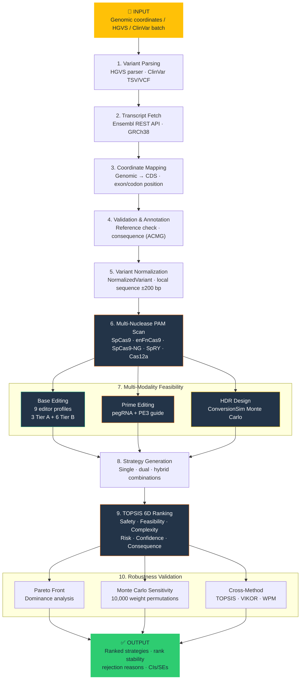

# CRISPRArchitect v3

**Multi-nuclease, consequence-guided decision support for genome editing strategy design**

CRISPRArchitect is a computational framework that evaluates base editing (BE), prime editing (PE), and homology-directed repair (HDR) within a unified, transparent decision-making system. Version 3 introduces multi-nuclease feasibility evaluation, TOPSIS-based multi-criteria ranking, and Monte Carlo sensitivity analysis.

## Pipeline Overview


<details>
<summary>Pipeline flowchart (Mermaid — click to expand)</summary>



</details>

## Key Features

- **Multi-nuclease evaluation**: 5 nucleases (SpCas9, enFnCas9, SpCas9-NG, SpRY, Cas12a) × 9 base editor profiles
- **Unified strategy space**: Evaluates BE, PE, HDR, and hybrid combinations together
- **TOPSIS 6D ranking**: Formal multi-criteria decision analysis (Hwang & Yoon, 1981)
- **Sensitivity analysis**: 10,000 Dirichlet-sampled weight permutations with rank stability reporting
- **Pareto front analysis**: Weight-independent dominance check across all 6 dimensions
- **Cross-method validation**: TOPSIS + VIKOR + WPM concordance (100% agreement)
- **Transcript-aware mapping**: Ensembl REST API, GRCh38, coding consequence annotation (ACMG)
- **Parameter provenance**: Every constant tagged [MEASURED], [DERIVED], or [ASSUMED] with citations
- **Explicit rejection**: Infeasible strategies tagged with reasons, not silently omitted

## v3 Key Finding: Base Editing Rescued

| Metric | v2 | v3 |
|--------|----|----|
| BE top-ranked | 0/30 (0%) | **6/30 (20%)** |
| PE top-ranked | 29/30 (97%) | 23/30 (77%) |
| HDR top-ranked | 1/30 (3%) | 1/30 (3%) |
| Scoring method | 5D weighted sum | **6D TOPSIS + Pareto + Monte Carlo** |
| Tests passing | 123 | **198** |

The multi-nuclease engine (ABE8e broader window + enFnCas9 NRG PAM) rescued base editing from 0% to 20% of cases. The bystander triple-counting bug in v2 was fixed by moving bystander severity to a dedicated Consequence dimension.

## Benchmark Results

Evaluated on 30 ClinVar cases with verified GRCh38 coordinates:

| Metric | v2 | v3 |
|--------|----|----|
| Top-1 Accuracy | 86.7% (26/30) | 86.7% (26/30) |
| Top-3 Accuracy | 96.7% (29/30) | 96.7% (29/30) |
| Rejection Accuracy | 90.0% (27/30) | 86.7% (26/30) |

## Architecture

CRISPRArchitect comprises three layers:

### v1 Modules (~24,000 LOC)
- **ConversionSim**: Monte Carlo HDR gene conversion tract simulator (validated against 4 published datasets)
- **MOSAIC**: Multi-locus editing strategy optimizer (benchmarked against 14 published papers)
- **TopoPred**: cssDNA secondary structure analyzer (G-quadruplex, hairpin, accessibility)
- **ChromBridge**: 3D chromatin distance and translocation risk predictor
- **LoopSim**: Cohesin loop extrusion simulator
- **WebApp**: Interactive Streamlit application

### v2 Modules (~9,400 LOC)
- **Sequence Layer**: Ensembl transcript fetcher, genomic-to-transcript mapper, reference validator, coding annotator, variant normalizer
- **Feasibility Layer**: Enhanced PAM scanner, base editing engine, prime editing engine, HDR design engine
- **Strategy Layer**: Consequence-aware strategy generator, annotation integrator
- **Pipeline**: End-to-end orchestrator (single entry point)
- **Benchmarks**: 30-case evaluation framework with publication-quality plotting

### v3 Additions (~12,500 LOC total core)
- **Multi-Nuclease Engine**: 5 nucleases × 9 base editor profiles with evidence tiers
- **TOPSIS Scorer**: 6-dimensional multi-criteria ranking with Pareto front analysis
- **Sensitivity Analysis**: Monte Carlo Dirichlet weight perturbation (10,000 permutations)
- **Cross-Method Validation**: VIKOR and WPM comparison methods
- **HGVS Parser**: NM_xxx:c.NNNRef>Alt notation support
- **ClinVar Batch**: TSV/VCF ingestion for batch analysis
- **Off-Target Scoring**: CFD and MIT specificity frameworks

## Quick Start

### Installation

```bash
git clone https://github.com/visvikbharti/CRISPRArchitect.git
cd CRISPRArchitect/crisprarchitect
pip install -r requirements.txt
```

### Run the pipeline

```python
from core.pipeline.strategy_stage import StrategyPipeline
from core.models import GenomicVariantInput

pipeline = StrategyPipeline(cell_type="iPSC", nuclease="SpCas9")

result = pipeline.run([
    GenomicVariantInput(
        chromosome="17",
        position=31200443,
        ref_allele="C",
        alt_allele="T",
        gene_symbol="NF1",
        name="c.910C>T",
    ),
])

for strategy in result.strategies:
    print(f"#{strategy.rank}: {strategy.strategy_name} "
          f"(TOPSIS={strategy.overall_score:.3f}, "
          f"stability={strategy.rank_stability:.1%})")
```

### Run the benchmark

```bash
python -m benchmarks.run_benchmark --input benchmarks/dataset_v1.json
```

### Run the interactive web app

```bash
streamlit run webapp/app.py
```

### Run tests

```bash
python -m pytest tests/ -v
```

## TOPSIS 6D Scoring

| Dimension | Weight | Type | What it captures |
|-----------|--------|------|------------------|
| Safety | 0.28 | Benefit | DSB count, p53 risk in iPSCs |
| Feasibility | 0.23 | Benefit | PAM + window verified, modality prior |
| Complexity | 0.19 | Cost | Rounds, donors, guides, screening |
| Risk | 0.14 | Cost | Structural rearrangement only |
| Confidence | 0.09 | Benefit | Evidence tier (A/B/C) |
| Consequence | 0.07 | Benefit | Bystander edits, splice proximity |

## Project Structure

```
crisprarchitect/
    core/                          # v2 + v3 modules
        models.py                  # Central data models
        sequence/                  # Transcript mapping and annotation
        feasibility/               # BE (9 profiles), PE, HDR engines
        mosaic/                    # Strategy generation and scoring
        pipeline/                  # End-to-end orchestrator + TOPSIS
    mosaic/                        # v1 strategy optimizer
    conversion_sim/                # v1 gene conversion simulator
    topopred/                      # v1 cssDNA structure analyzer
    chrombridge/                   # v1 3D chromatin predictor
    loopsim/                       # v1 cohesin loop simulator
    utils/                         # Shared utilities and constants
    webapp/                        # Streamlit interactive app
    benchmarks/                    # Evaluation framework
    tests/                         # 198 passing tests
    paper/                         # Manuscript and figures
    docs/                          # Documentation and guides
```

## Requirements

- Python 3.9+
- NumPy >= 1.24.0
- SciPy >= 1.10.0
- Matplotlib >= 3.7.0
- Streamlit >= 1.30.0 (for web app)

## Citation

If you use CRISPRArchitect in your research, please cite:

> Bharti V, Chakraborty D. CRISPRArchitect: multi-nuclease decision support for genome editing strategy design. (2026). *In preparation for PLOS Computational Biology.*

## License

MIT License

## Authors

- **Vishal Bharti** — CSIR-Institute of Genomics and Integrative Biology, New Delhi
- **Debojyoti Chakraborty** — CSIR-Institute of Genomics and Integrative Biology, New Delhi
