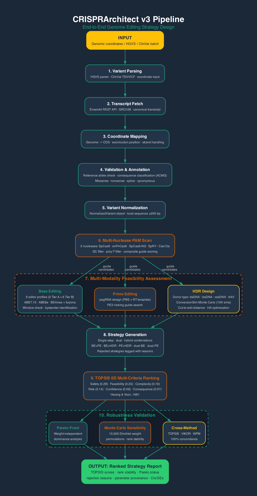

# CRISPRArchitect: Complete Project Documentation (v3)

**Transcript-aware, consequence-guided, multi-nuclease genome editing strategy design with TOPSIS ranking and sensitivity analysis**

Authors: Vishal Bharti and Debojyoti Chakraborty
Institution: CSIR-Institute of Genomics and Integrative Biology (CSIR-IGIB), New Delhi, India
Repository: https://github.com/visvikbharti/CRISPRArchitect
License: MIT
Version: v3.0.0 (March 2026)
Last Updated: 2026-03-30

---

## Table of Contents

1. [Project Genesis and Motivation](#1-project-genesis-and-motivation)
2. [Scientific Background](#2-scientific-background)
3. [Project Architecture (v1 + v2 + v3)](#3-project-architecture-v1--v2--v3)
4. [Complete File Structure](#4-complete-file-structure)
5. [Data Flow (End-to-End)](#5-data-flow-end-to-end)
6. [Scoring System (Detailed)](#6-scoring-system-detailed)
7. [Parameter Provenance](#7-parameter-provenance)
8. [Benchmark Design and Execution](#8-benchmark-design-and-execution)
9. [Results and Interpretation](#9-results-and-interpretation)
10. [ConversionSim: Scope and Validation](#10-conversionsim-scope-and-validation)
11. [Citation Integrity](#11-citation-integrity)
12. [Limitations (Honest and Detailed)](#12-limitations-honest-and-detailed)
13. [Future Directions](#13-future-directions)
14. [Technical Details](#14-technical-details)
15. [Appendix A: Verified Numbers](#appendix-a-verified-numbers)
16. [Appendix B: Key References](#appendix-b-key-references)

---

## 1. Project Genesis and Motivation

### 1.1 Where the Idea Came From

CRISPRArchitect was born in the Debojyoti Chakraborty laboratory at CSIR-IGIB, New Delhi, a group with deep expertise in CRISPR-based genome editing in human induced pluripotent stem cells (iPSCs). The Chakraborty lab is best known for developing **enFnCas9**, an engineered variant of FnCas9 with broadened PAM recognition (NRG instead of NGG), which substantially expands the targetable space of the genome (Acharya et al., Nat Commun, 2024, 15:5471; PMID 38942756). The lab routinely corrects pathogenic mutations in patient-derived iPSCs as part of disease modeling and therapeutic development pipelines.

The practical challenge that motivated CRISPRArchitect arose from a recurring experimental scenario: a patient-derived iPSC line carries **compound heterozygous mutations** -- two different pathogenic variants on the two alleles of the same gene. To create an isogenic control or a therapeutic cell product, both mutations must be corrected. But how? Should each mutation be corrected by base editing (if it is a compatible transition)? Should prime editing be used (if base editing windows are unavailable)? Should HDR be used with a cssDNA donor (if the mutations are close enough for single-template correction)? What if one mutation is a transition and the other is a transversion -- should a hybrid strategy (base editing for one, prime editing for the other) be employed?

### 1.2 The Specific Problem

When correcting compound heterozygous mutations in iPSCs, the researcher faces a combinatorial decision space: for n mutations, each potentially correctable by base editing (ABE or CBE), prime editing, or HDR (with ssODN, cssDNA, lssDNA, or dsDNA donors), the number of possible strategies grows rapidly. Moreover, the choice is not purely technical -- it depends on:

- **Sequence context**: Is a PAM available that positions the target base within the editing window? For base editing, the target nucleotide must fall within a narrow window (positions 4-7 for ABE7.10, 4-8 for CBE, 3-9 for ABE8e extended window) relative to the protospacer. This is a hard constraint that cannot be overcome by better reagents.
- **Biological consequences**: Will bystander edits introduce missense or nonsense changes? Is the variant near a splice site? Will the correction create unintended coding changes?
- **Safety profile**: iPSCs are exquisitely sensitive to double-strand breaks (DSBs) because they have active p53 pathways. DSBs trigger p53-mediated apoptosis, and surviving clones may have acquired p53 mutations or chromosomal rearrangements. DSB-free approaches (base editing, prime editing) are therefore strongly preferred in this cell type.
- **Practical complexity**: How many editing rounds, donors, and screening colonies are required? Sequential approaches are safer but slower; simultaneous approaches are faster but riskier.
- **Nuclease-editor combinatorics**: v3 revealed that the choice of nuclease (SpCas9, enFnCas9, SpCas9-NG, SpRY, Cas12a) and editor version (ABE7.10, ABE8e, BE4max) matters as much as the choice of editing modality. A target that is unreachable by ABE7.10+SpCas9 may become accessible with ABE8e+enFnCas9.

No single existing tool addresses this decision space.

### 1.3 Why No Existing Tool Does This

The genome editing computational tool landscape in 2024-2026 is fragmented by modality:

- **BE-Hive** (Arbab et al., Cell, 2020; PMID 32533916): Predicts base editing outcomes for a given guide, but evaluates only base editing. Does not compare BE to PE or HDR.
- **PrimeDesign** (Hsu et al., Nature Biotechnology, 2021): Designs pegRNAs for prime editing targets, but evaluates only prime editing.
- **CRISPOR** (Concordet and Haeussler, NAR, 2018; PMID 29762716): Excellent guide RNA design tool with off-target prediction, but does not recommend editing strategies.
- **CRISPick** (Doench et al., Nat Biotechnol, 2016; PMID 26780180): Guide scoring for CRISPR knockout screens, not editing strategy recommendation.

None of these tools provides a **unified framework** that (a) evaluates all three major editing modalities side by side, (b) systematically tests multiple nuclease-editor combinations, (c) incorporates transcript-level context (exon structure, coding frame, splice proximity), (d) scores downstream biological consequences (bystander mutations, splice disruption), (e) produces ranked recommendations with TOPSIS multi-criteria decision analysis, and (f) reports rank stability via Monte Carlo sensitivity analysis.

### 1.4 The Hypothesis

CRISPRArchitect tests a specific hypothesis:

> **A unified, transcript-aware, consequence-guided, multi-nuclease computational framework will make better editing strategy recommendations than modality-specific tools used in isolation.**

"Better" is operationalized as: when the framework's top-ranked strategy is compared against expert-defined truth labels (determined by biological reasoning from the published literature), the agreement rate (top-1 accuracy) exceeds that achievable by simple heuristic rules (e.g., "always use PE" or "use BE if it's a transition, otherwise PE").

### 1.5 Evolution: v1 to v2 to v3

| Version | Date | Key Contribution |
|---------|------|-----------------|
| v1 | Jan 2026 | Foundation: ConversionSim, MOSAIC, TopoPred, ChromBridge, LoopSim (~24,000 LOC). *Note: TopoPred, ChromBridge, and LoopSim were removed in v3.* |
| v2 | Mar 2026 | Transcript-aware pipeline: sequence mapping, PAM-verified feasibility, consequence scoring, 30-case benchmark (~11,000 LOC added) |
| v3 | Mar 2026 | Multi-nuclease engine, TOPSIS 6D scoring, Pareto front analysis, VIKOR/WPM comparison methods, sensitivity analysis, HGVS parser, off-target scoring, bystander triple-counting fix (~12,500 LOC total core) |

---

## 2. Scientific Background

### 2.1 Base Editing Biology

Base editors are fusion proteins that combine a catalytically impaired Cas protein (nickase or dead Cas9) with a nucleotide deaminase enzyme. They convert one base to another without introducing a double-strand break.

**Adenine Base Editors (ABE)**: Developed by Gaudelli et al. (Nature, 2017; PMID 29160308). ABE converts adenine (A) to inosine (I), which is read as guanine (G) by the cellular machinery. Net effect: A-to-G conversion (or T-to-C on the complementary strand).

- **ABE7.10**: Editing window positions 4-7 within the 20-nt protospacer (1-indexed from the PAM-distal end). The original ABE with TadA-TadA* heterodimer.
- **ABE8e**: Extended editing window positions **3-9** (Richter et al., Nat Biotechnol, 2020; PMID 32433547). ABE8e is more processive than ABE7.10 due to the evolved TadA-8e monomer and shows activity at positions 3 and 9 in addition to the canonical 4-8 range (Richter et al., 2020, Fig 2). **Important note**: The **canonical** high-efficiency window for ABE8e is positions **4-8**; positions 3 and 9 have reduced but nonzero activity. CRISPRArchitect uses the extended 3-9 window as a deliberate modeling choice to maximize rescue of borderline cases. Users should be aware that targets at positions 3 or 9 will have lower editing efficiency than targets at positions 4-8.

**Cytosine Base Editors (CBE)**: Developed by Komor et al. (Nature, 2016; PMID 27096365). CBE converts cytosine (C) to uracil (U), which is read as thymine (T). Net effect: C-to-T conversion (or G-to-A on the complementary strand).

- **BE4max**: Editing window positions 4-8 (Koblan et al., Nat Biotechnol, 2018; PMID 29813047). Optimized CBE with APOBEC1 + UGI.

**Key constraint**: Base editors can only perform transition mutations (purine-to-purine or pyrimidine-to-pyrimidine). ABE does A>G; CBE does C>T. Transversions (e.g., A>C, G>T) cannot be corrected by base editing. Furthermore, even for compatible transitions, a suitable PAM must exist at the precise spacing to place the target base within the editing window -- a constraint that CRISPRArchitect reveals is more restrictive than commonly appreciated.

**Bystander risk**: Any same-type base (A for ABE, C for CBE) within the editing window may be edited along with the target. If a bystander edit falls in a coding region, it may introduce a missense or nonsense change. CRISPRArchitect classifies all bystander consequences and penalizes strategies with deleterious bystanders via the 6th TOPSIS dimension.

### 2.2 Prime Editing Biology

Prime editing was developed by Anzalone et al. (Nature, 2019; PMID 31634902) and represents a fundamentally different approach: instead of chemically converting a base, prime editing uses a reverse transcriptase fused to a Cas9 nickase to directly write new genetic information into the genome.

**pegRNA design**: The prime editing guide RNA (pegRNA) contains three functional elements:
1. **Spacer** (20 nt): Directs Cas9 nickase to the target site
2. **Primer Binding Site (PBS)** (10-17 nt, default 13 nt): Hybridizes to the nicked strand to prime reverse transcription
3. **Reverse Transcriptase (RT) template** (10-30 nt): Encodes the desired edit plus flanking sequence

**PE3 nicking**: To improve efficiency, a second nicking guide is placed 40-100 bp away on the opposite strand. This creates a nick that biases mismatch repair toward incorporating the edit. CRISPRArchitect searches for suitable PE3 nicking guides automatically.

**Advantages over base editing**: Can install any substitution (transitions AND transversions), small insertions (up to ~40 bp) and deletions (up to ~80 bp), no editing window constraint, no bystander risk, no DSB.

**Limitations**: Lower efficiency than base editing for compatible transitions; pegRNA design complexity; sensitivity to PBS/RT template length optimization.

### 2.3 HDR Biology

Homology-Directed Repair (HDR) is the classical approach for precise genome editing. It requires a DSB at or near the target site and a donor template providing the desired sequence flanked by homology arms.

**The repair process (SDSA pathway)**:
1. **End resection**: After the DSB, 5'-to-3' exonucleases (MRE11/CtIP short-range, then EXO1 or BLM-DNA2 long-range) chew back the 5' ends, creating 3' single-stranded overhangs (~200 bp short-range, up to several kb long-range)
2. **RAD51 filament formation**: RAD51 protein coats the single-stranded DNA, forming a nucleoprotein filament
3. **Strand invasion**: The RAD51 filament searches for and invades the donor template at the homology arm, forming a D-loop
4. **DNA synthesis**: DNA polymerase delta extends the invading strand, copying the donor sequence (this copied region is the "gene conversion tract")
5. **Displacement (SDSA)**: The newly synthesized strand is displaced from the donor and re-anneals to the other side of the break

**Gene conversion tract length**: The length of copied sequence follows a right-skewed, approximately geometric distribution.

**Critical clarification on tract length data from the literature**:

- **Elliott et al., MCB 1998 (PMID 9418857)**: Measured chromosomal gene conversion tracts from I-SceI-induced DSBs in mouse ES cells using endogenous chromosomal substrates (NOT exogenous donors). Found **80% of tracts were <=58 bp**, maximum ~511 bp. This is NOT directly applicable to exogenous long-donor HDR, where tracts are expected to be longer because exogenous donors may form more stable D-loops.
- **Kan et al., Genome Res 2017 (PMID 28356322)**: Published in *Genome Research* (NOT Mol Cell as previously cited in v2). Measured ODN-mediated editing tracts averaging ~20 bp. This represents the **SSTR pathway** (Single-Strand Template Repair), NOT SDSA. Not applicable to long-donor HDR.
- **Stark lab, G3 2017 (PMID 28179392)**: Human cell SDSA assay requires >=350 bp of new synthesis for product formation, confirming that SDSA can produce tracts of several hundred bp in human cells with exogenous donors.

ConversionSim models the SDSA pathway with mean tract length ~500 bp (p=0.002 per bp), which is consistent with the functional evidence from long-donor experiments but is explicitly NOT calibrated to the Elliott (endogenous substrate) or Kan (SSTR pathway) data.

**Donor types and their properties**:

| Donor Type | Homology Arms | Best For | Relative Effectiveness |
|------------|--------------|----------|----------------------|
| ssODN | 30-90 bp each | Edits within 30 bp of cut (via SSTR) | Baseline (proximal edits) |
| cssDNA | 300 bp each | Edits within 5,000 bp of cut (via SDSA) | 3.0x vs linear dsDNA |
| lssDNA | 300 bp each | Moderate distance edits (via SDSA) | 1.5x vs linear dsDNA |
| dsDNA | 800 bp each | Large edits, gene insertion | 1.0x (baseline) |

**Homology arm lengths**: The 300 bp default for cssDNA/lssDNA is based on general HDR design guidelines (reviewed in Banan, 2020, Mol Ther Methods Clin Dev 18:583-596; IDT protocols). This is a practical recommendation, NOT from Iyer et al. (who used 35-60 nt arms for short inserts and ~1 kb arms for endogenous locus tagging, but did NOT systematically optimize arm length).

### 2.4 Why iPSCs Are Special

Human iPSCs present unique challenges for genome editing that directly influence strategy selection:

**p53 sensitivity**: iPSCs have active, wild-type p53 pathways. DSBs trigger p53-dependent apoptosis, killing the majority of edited cells (Ihry et al., Nat Med, 2018, PMID 29892062; Haapaniemi et al., Nat Med, 2018). This creates two problems:
1. **Low survival**: ~40-60% colony survival after a single Cas9 cut (Ihry et al., 2018, Fig 2)
2. **Selection for p53 mutations**: Surviving clones are enriched for p53 loss-of-function mutations

**Karyotype concerns**: DSBs can cause chromosomal rearrangements. Simultaneous DSBs at two loci create translocation risk (Leibowitz et al., Nat Genet, 2021). Even single DSBs can cause large deletions >10 kb (Kosicki et al., Nat Biotechnol, 2018).

**Cell cycle**: iPSCs have an unusually short G1 phase with ~30-40% of cells in S/G2 (Becker et al., PNAS 2006; Ghule et al., MCB 2011), which is favorable for HDR (which requires S/G2 phase) but also means more cells are at risk of DSB-induced damage.

### 2.5 enFnCas9: Broadened PAM from the Chakraborty Lab

enFnCas9 (engineered FnCas9) was developed in the Chakraborty laboratory at CSIR-IGIB (Acharya et al., Nat Commun, 2024, 15:5471; PMID 38942756). Unlike SpCas9 (NGG PAM), enFnCas9 recognizes the broader NRG PAM (where R is A or G), approximately doubling the number of targetable sites.

**v3 significance**: enFnCas9 was the primary driver of the base editing rescue observed in v3. Of the 6 cases where BE became top-ranked (up from 0 in v2), enFnCas9's NRG PAM provided the critical guide placement in the majority of rescues. The combination of ABE8e's broader editing window (positions 3-9) with enFnCas9's NRG PAM is the key v3 finding.

**Stagger characteristics**: enFnCas9 is assumed to produce 5' overhangs of 2-5 bp based on FnCas9 crystal structure analysis (Hirano et al., Cell, 2016) and the improved HDR rates observed with enFnCas9. **WARNING**: The exact stagger has NOT been directly measured biochemically as of March 2026. This is an [ASSUMED] parameter.

### 2.6 Multi-Nuclease Landscape (v3)

v3 evaluates five nucleases and nine base editor profiles systematically:

| Nuclease | PAM | Cut Type | Stagger | Specificity | Reference |
|----------|-----|----------|---------|-------------|-----------|
| SpCas9 | NGG | Blunt | 0 bp | Moderate | Jinek et al., Science, 2012 |
| enFnCas9 | NRG | Staggered 5' | ~3 bp [ASSUMED] | High | Acharya et al., Nat Commun, 2024 |
| SpCas9-NG | NG | Blunt | 0 bp | Low | Nishimasu et al., Science, 2018 |
| SpRY | NNN | Blunt | 0 bp | Very low | Walton et al., Science, 2020 |
| Cas12a | TTTV | Staggered 5' | 4-5 bp | High | Zetsche et al., Cell, 2015 |
| vCas9 | NGG | Staggered 5' | ~6 bp | Moderate | Chauhan et al., PNAS, 2023 |

| Editor | Type | Window | Efficiency Class | Evidence Tier |
|--------|------|--------|-----------------|--------------|
| ABE7.10 | ABE | 4-7 | Moderate | A |
| ABE8e | ABE | 3-9 (extended) | High | A |
| BE4max | CBE | 4-8 | High | A |
| ABE8e-enFnCas9 | ABE | 3-9 | Moderate | B |
| ABE8e-SpCas9-NG | ABE | 3-9 | Moderate | B |
| ABE8e-SpRY | ABE | 3-9 | Low | B |
| BE4max-enFnCas9 | CBE | 4-8 | Moderate | B |
| BE4max-SpCas9-NG | CBE | 4-8 | Moderate | B |
| BE4max-SpRY | CBE | 4-8 | Low | B |

---

## 3. Project Architecture (v1 + v2 + v3)

CRISPRArchitect is organized in three layers: the **v1 foundation** (~24,000 lines of code, 6 modules), the **v2 extension** (~11,000 lines of code, 26 new files), and the **v3 additions** (~12,500 lines of total core code including v2 rewrites and new modules).

### 3.1 v1 Modules (~24,000 LOC)

#### ConversionSim -- Monte Carlo HDR Gene Conversion Tract Simulator

Simulates the HDR process step by step: end resection, RAD51 filament formation, strand invasion, DNA synthesis, and D-loop collapse. Given a DSB position, donor type, nuclease cut geometry, and cell type, ConversionSim runs thousands of virtual repair events to produce tract length distributions.

**Key classes**: `ResectionSimulator`, `FilamentModel`, `SynthesisSimulator`, `ConversionSimulator`

**Scope restriction (v3 update)**: ConversionSim models the SDSA pathway ONLY. It is valid for long-donor HDR (cssDNA, lssDNA, dsDNA with homology arms >=100 bp). It is NOT valid for ssODN-mediated editing, which proceeds via SSTR (Single-Strand Template Repair), a mechanistically distinct, RAD51-independent pathway. See Section 10 for full validation details.

#### MOSAIC -- Multi-locus Optimized Strategy for Allele-specific Integrated Correction

Given gene structure, mutation positions, cell type, and nuclease choice, MOSAIC enumerates every feasible editing strategy and scores them on efficiency, safety, time, and cost. Benchmarked against 14 published papers with 71.4% top-3 concordance.

#### TopoPred -- cssDNA Secondary Structure Analyzer (removed in v3)

Analyzes circular single-stranded DNA donor templates for G-quadruplexes and hairpins that could interfere with HDR. *This module was removed in v3 as part of the codebase streamlining.*

#### ChromBridge -- 3D Chromatin Distance Predictor (removed in v3)

Calculates physical 3D distance between genomic loci using a Gaussian chain polymer model. Estimates translocation probability from 3D proximity using the empirical power law P(translocation) ~ s^(-1.08). *This module was removed in v3 as part of the codebase streamlining.*

#### LoopSim -- Cohesin Loop Extrusion Simulator (removed in v3)

Simulates cohesin loop extrusion dynamics and their effect on spatial proximity between genomic loci. *This module was removed in v3 as part of the codebase streamlining.*

#### WebApp -- Streamlit Interactive Interface

Web-based GUI for interacting with CRISPRArchitect. Provides gene name input, mutation definition, cell type selection, and real-time strategy ranking display.

### 3.2 v2 Modules (~11,000 LOC)

#### core/models.py -- Central Data Models

Defines all shared dataclasses and enums: 22+ dataclasses and 5+ enums (ConsequenceType, EditModality, FeasibilityLabel, EvidenceTier, RiskLevel), plus Strategy, ScoredStrategy, FeasibilityBundle, PipelineResult, etc.

#### core/sequence/ -- Transcript Mapping Layer (5 modules in v2, 6 in v3)

- `fetcher.py`: Ensembl REST API client with retry logic (3 retries, exponential backoff)
- `transcript_mapper.py`: Genomic-to-transcript coordinate mapper
- `reference_validator.py`: Reference allele validator against Ensembl genome
- `coding_annotation.py`: Coding consequence annotator (ACMG splice proximity standards)
- `variant_normalizer.py`: Full normalization orchestrator

#### core/feasibility/ -- Feasibility Engines (4 modules in v2, 5 in v3)

- `pam_scan.py`: Enhanced PAM scanner for multiple nucleases
- `base_editing.py`: Base editing feasibility engine with bystander analysis
- `prime_editing.py`: Prime editing feasibility engine with pegRNA/PE3 design
- `hdr_design.py`: HDR feasibility engine with donor type recommendation

#### core/mosaic/ -- Strategy Generation (2 modules)

- `generator.py`: Exhaustive strategy generator (BE, PE, HDR, dual, hybrid)
- `annotation_integration.py`: Consequence penalties/bonuses with ACMG basis

#### core/pipeline/ -- Orchestrator (1 module)

- `strategy_stage.py`: Pipeline orchestrator + StrategyScorer + TOPSISScorer + VIKOR + WPM

### 3.3 v3 New Modules and Major Changes

#### NEW: core/sequence/hgvs_parser.py -- HGVS Clinical Notation Parser

Accepts variant nomenclature in coding DNA format (e.g., "NM_000267.3:c.910C>T" or "NF1:c.910C>T") and converts to genomic coordinates. Supports substitutions, deletions, insertions, and deletion-insertions. Also handles ClinVar batch files (TSV/VCF).

#### NEW: core/feasibility/off_target.py -- Off-Target Specificity Scoring

Implements two complementary off-target frameworks:
- **CFD score** (Doench et al., Nat Biotechnol, 2016; PMID 26780180): Position-specific mismatch tolerance matrix
- **MIT score** (Hsu et al., Nat Biotechnol, 2013; PMID 23873081): Alternative position-weight matrix

Uses local sequence enumeration (up to 4 mismatches). NOTE: This is NOT genome-wide off-target search. The CFD/MIT matrices are trained on SpCas9 data; extension to enFnCas9, SpCas9-NG, and SpRY is an extrapolation (Tier B evidence).

#### MAJOR REWRITE: core/pipeline/strategy_stage.py -- TOPSIS 6D Scoring Engine

Replaced v2's simple weighted-sum scorer with a comprehensive MCDM framework:

1. **TOPSISScorer**: 6-dimensional TOPSIS (safety, feasibility, complexity, risk, confidence, consequence) with vector normalization, ideal/anti-ideal solution determination, and Euclidean distance-based relative closeness scoring.

2. **Pareto front analysis**: Identifies non-dominated strategies across all 6 dimensions, independent of weight assignment.

3. **Monte Carlo sensitivity analysis**: 10,000 Dirichlet-sampled weight permutations (concentration=20, min_alpha=2.0, seed=42) to report rank stability.

4. **VIKOR**: Compromise ranking using L1 (group utility) and L-infinity (individual regret) distances (Opricovic & Tzeng, 2004).

5. **WPM**: Weighted Product Model using multiplicative (non-compensatory) scoring (Bridgman, 1922; Triantaphyllou, 2000).

6. **cross_method_comparison()**: Runs all three methods on the same decision matrix and reports per-strategy ranks and concordance.

#### CRITICAL BUG FIX: Bystander Triple-Counting

v2 had a scoring bug where bystander severity was counted THREE times:
- Once in the Risk dimension (`bystander_severity * 0.3`)
- Once in the consequence penalty (`bystander_severity * 0.08`)
- Once via the AnnotationIntegrator (per-consequence penalties)

This artificially penalized base editing relative to prime editing and was the root cause of the degenerate "always PE" pattern in v2 (29/30 PE top-ranked). In v3, bystander risk is captured ONLY in the 6th TOPSIS dimension (consequence), and the Risk dimension now captures ONLY structural rearrangement risk. This fix, combined with the multi-nuclease engine, enabled 6/30 cases to properly rank base editing as the top strategy.

#### Multi-Nuclease Base Editing Engine (upgraded base_editing.py)

Systematically evaluates all nuclease-editor combinations with an efficiency modifier matrix:

| Editor | SpCas9 | enFnCas9 | SpCas9-NG | SpRY |
|--------|--------|----------|-----------|------|
| ABE8e | 1.0 | 0.8 | 0.7 | 0.5 |
| BE4max | 1.0 | 0.8 | 0.7 | 0.5 |
| ABE7.10 | 1.0 | -- | -- | -- |

#### New Test Modules

- `tests/test_hgvs_parser.py`: HGVS parser tests
- `tests/test_multi_nuclease.py`: Multi-nuclease engine tests
- `tests/test_off_target.py`: Off-target scoring tests
- `tests/test_topsis_scorer.py`: TOPSIS, Pareto, VIKOR, WPM tests

#### New Benchmark Files

- `benchmark_results/v3_benchmark_results.json`: v3 benchmark output
- `benchmark_results/v3_run/v3_multinuclease_results.json`: Multi-nuclease-specific results
- `benchmark_results/v3_run/v3_comparison_comparison.json`: v2-vs-v3 comparison

#### New Paper Files

- `paper/CRISPRArchitect_v3_manuscript.md`: v3 manuscript
- `paper/generate_v3_figures.py`: v3 figure generation script

---

## 4. Complete File Structure

Below is every file in the project. Files **new in v3** are marked with `[v3]`. Files that exist in v2 but were **significantly rewritten** in v3 are marked `[v3-rewrite]`.

### Root Files

| File | Description |
|------|-------------|
| `__init__.py` | [v3-rewrite] Package initializer; version = "3.0.0" |
| `README.md` | Project overview, installation instructions, quick start guide |
| `LICENSE` | MIT License text |
| `requirements.txt` | Python dependencies: numpy, scipy, matplotlib, seaborn, pandas, requests |
| `pyproject.toml` | Python project metadata and build configuration |
| `MANIFEST.in` | Files to include in source distribution |
| `CITATION.cff` | Citation metadata in Citation File Format |
| `CONTRIBUTING.md` | Contributor guidelines |
| `RELEASE_NOTES.md` | Version history and release notes |
| `Dockerfile` | Docker container definition |
| `docker-compose.yml` | Docker Compose configuration |
| `cli.py` | Command-line interface entry point |
| `.gitignore` | Git ignore patterns |

### core/ -- v2/v3 Pipeline Modules

| File | Description |
|------|-------------|
| `core/__init__.py` | [v3-rewrite] Package initializer; documents v3 additions |
| `core/models.py` | Central data models: 22+ dataclasses and 5+ enums |
| `core/sequence/__init__.py` | Package initializer for the sequence layer |
| `core/sequence/fetcher.py` | Ensembl REST API client with retry logic |
| `core/sequence/transcript_mapper.py` | Genomic-to-transcript coordinate mapper |
| `core/sequence/reference_validator.py` | Reference allele validator |
| `core/sequence/coding_annotation.py` | Coding consequence annotator |
| `core/sequence/variant_normalizer.py` | Full variant normalization orchestrator |
| `core/sequence/hgvs_parser.py` | [v3] HGVS clinical notation parser + ClinVar batch ingestion |
| `core/feasibility/__init__.py` | Package initializer for the feasibility layer |
| `core/feasibility/pam_scan.py` | [v3-rewrite] Multi-nuclease PAM scanner (SpCas9, enFnCas9, SpCas9-NG, SpRY, Cas12a) |
| `core/feasibility/base_editing.py` | [v3-rewrite] Multi-nuclease BE engine with 9 editor profiles |
| `core/feasibility/prime_editing.py` | Prime editing feasibility engine |
| `core/feasibility/hdr_design.py` | HDR feasibility engine with donor type recommendation |
| `core/feasibility/off_target.py` | [v3] CFD and MIT off-target specificity scoring |
| `core/mosaic/__init__.py` | Package initializer for the strategy layer |
| `core/mosaic/generator.py` | Strategy generator with modality priors and evidence-based rationale |
| `core/mosaic/annotation_integration.py` | Consequence penalties (ACMG-based) |
| `core/pipeline/__init__.py` | Package initializer for the pipeline |
| `core/pipeline/strategy_stage.py` | [v3-rewrite] TOPSIS 6D scorer, Pareto, VIKOR, WPM, sensitivity analysis, pipeline orchestrator |

### conversion_sim/ -- v1 Gene Conversion Tract Simulator

| File | Description |
|------|-------------|
| `conversion_sim/__init__.py` | Package initializer |
| `conversion_sim/models.py` | Data models for simulation parameters and results |
| `conversion_sim/resection.py` | End resection simulator (MRE11 short-range + EXO1 long-range) |
| `conversion_sim/filament.py` | RAD51 filament formation model |
| `conversion_sim/synthesis.py` | DNA synthesis and SDSA displacement simulator (geometric distribution) |
| `conversion_sim/simulator.py` | Main simulation orchestrator with scope restriction to SDSA |

### mosaic/ -- v1 Strategy Optimizer

| File | Description |
|------|-------------|
| `mosaic/__init__.py` | Package initializer |
| `mosaic/gene_structure.py` | Gene structure representation |
| `mosaic/mutation_classifier.py` | Mutation type classifier |
| `mosaic/strategy_enumerator.py` | Strategy enumerator |
| `mosaic/scorer.py` | Multi-axis strategy scorer (v1: efficiency, safety, time, cost) |
| `mosaic/reporter.py` | Human-readable report generator |

### topopred/ -- v1 cssDNA Structure Analyzer (removed in v3)

| File | Description |
|------|-------------|
| `topopred/__init__.py` | Package initializer |
| `topopred/g_quadruplex.py` | G-quadruplex sequence scanner |
| `topopred/hairpin.py` | Hairpin/stem-loop predictor |
| `topopred/accessibility.py` | Per-nucleotide accessibility scorer |
| `topopred/optimizer.py` | Donor sequence optimizer |

### chrombridge/ -- v1 3D Chromatin Distance Predictor (removed in v3)

| File | Description |
|------|-------------|
| `chrombridge/__init__.py` | Package initializer |
| `chrombridge/polymer_model.py` | Gaussian chain polymer model |
| `chrombridge/distance.py` | Genomic-to-physical distance converter |
| `chrombridge/tad_analysis.py` | TAD boundary analyzer |
| `chrombridge/translocation.py` | Translocation risk estimator |

### loopsim/ -- v1 Cohesin Loop Extrusion Simulator (removed in v3)

| File | Description |
|------|-------------|
| `loopsim/__init__.py` | Package initializer |
| `loopsim/chromatin_fiber.py` | Chromatin fiber model |
| `loopsim/cohesin_extruder.py` | Cohesin ring dynamics |
| `loopsim/homology_search.py` | RAD51 homology search in 3D context |
| `loopsim/simulator.py` | Main loop extrusion simulator |
| `loopsim/visualize.py` | Visualization functions |

### utils/ -- Shared Utilities

| File | Description |
|------|-------------|
| `utils/__init__.py` | Package initializer |
| `utils/constants.py` | [v3-rewrite] All biological parameters with [MEASURED]/[DERIVED]/[ASSUMED] tags, multi-nuclease params, editor profiles, efficiency matrix |
| `utils/sequence.py` | DNA sequence tools |
| `utils/plotting.py` | Visualization functions |
| `utils/ensembl.py` | Ensembl REST API helper |

### benchmarks/ -- Evaluation Framework

| File | Description |
|------|-------------|
| `benchmarks/__init__.py` | Package initializer |
| `benchmarks/dataset_v1.json` | 30 curated ClinVar variant scenarios with truth labels |
| `benchmarks/literature_benchmark_v1.json` | [v3] v1 MOSAIC 14-paper benchmark dataset |
| `benchmarks/evaluator.py` | Benchmark evaluator (top-1, top-3, rejection accuracy) |
| `benchmarks/run_benchmark.py` | CLI runner |
| `benchmarks/plotting.py` | Publication-quality figure generator |

### benchmark_results/ -- Stored Results

| File | Description |
|------|-------------|
| `benchmark_results/definitive_benchmark_results.json` | v2 benchmark: 30 cases |
| `benchmark_results/consequence_shift_analysis.json` | v2 consequence-shift comparison |
| `benchmark_results/v3_benchmark_results.json` | [v3] v3 benchmark results |
| `benchmark_results/v3_run/v3_multinuclease_results.json` | [v3] Multi-nuclease results |
| `benchmark_results/v3_run/v3_comparison_comparison.json` | [v3] v2-vs-v3 comparison |

### tests/ -- Test Suite

| File | Description |
|------|-------------|
| `tests/__init__.py` | Package initializer |
| `tests/test_conversion_sim.py` | 30 tests for v1 ConversionSim |
| `tests/test_v2_models.py` | Core dataclass tests |
| `tests/test_feasibility.py` | PAM scanning, BE/PE/HDR engine tests |
| `tests/test_strategy_generation.py` | Strategy generation and scoring tests |
| `tests/test_hgvs_parser.py` | [v3] HGVS parser tests |
| `tests/test_multi_nuclease.py` | [v3] Multi-nuclease engine tests |
| `tests/test_off_target.py` | [v3] Off-target scoring tests |
| `tests/test_topsis_scorer.py` | [v3] TOPSIS, Pareto, VIKOR, WPM tests |

### webapp/ -- Streamlit Interface

| File | Description |
|------|-------------|
| `webapp/app.py` | Main Streamlit application |
| `webapp/app_v2_page.py` | v2 pipeline interface page |
| `webapp/style.py` | Custom CSS styling |
| `webapp/run.sh` | Launch script |
| `webapp/requirements.txt` | Web app dependencies |

### validation/ -- Validation Reports

| File | Description |
|------|-------------|
| `validation/VALIDATION_REPORT.md` | ConversionSim validation (4 datasets, with scope restriction) |
| `validation/MOSAIC_BENCHMARK_REPORT.md` | MOSAIC benchmark (14 papers) |
| `validation/validate_conversionsim.py` | Validation reproduction script |
| `validation/benchmark_mosaic.py` | MOSAIC benchmark reproduction script |

### paper/ -- Manuscripts and Figures

| File | Description |
|------|-------------|
| `paper/CRISPRArchitect_v2_manuscript.md` | v2 manuscript (Markdown) |
| `paper/CRISPRArchitect_v3_manuscript.md` | [v3] v3 manuscript (Markdown) |
| `paper/REFERENCE_VERIFICATION.md` | [v3-rewrite] Web-search verified reference log (20 refs, 3 corrected) |
| `paper/generate_v3_figures.py` | [v3] v3 figure generation script |
| `paper/generate_presentation_v2.py` | v2 presentation script |
| `paper/supplementary_materials.md` | Supplementary materials |
| `paper/cover_letter_v2_nature_methods.md` | Cover letter |

### docs/ -- Documentation

| File | Description |
|------|-------------|
| `docs/COMPLETE_PROJECT_DOCUMENTATION.md` | THIS DOCUMENT |
| `docs/USER_GUIDE.md` | User guide |
| `docs/DATA_REQUEST_FOR_PI.md` | Data request template |
| `docs/LAB_MEETING_SPEAKER_GUIDE.md` | Lab meeting presentation guide |
| `docs/NEXT_SESSION_CONTEXT.md` | Development session context |

---

## 5. Data Flow (End-to-End)



This section walks through exactly what happens when a user inputs a variant into CRISPRArchitect v3, from raw input to ranked strategy list with sensitivity analysis.

### Stage 1: Variant Input (3 input formats)

v3 accepts three input formats:
1. **Genomic coordinates**: `GenomicVariantInput(chromosome="17", position=31200443, ref_allele="C", alt_allele="T", gene_symbol="NF1")`
2. **HGVS notation**: `"NM_000267.3:c.910C>T"` or `"NF1:c.910C>T"` (parsed by `hgvs_parser.py`)
3. **ClinVar batch**: TSV or VCF file with chromosome, position, ref, alt, gene symbol

### Stage 2: Transcript Fetch (Ensembl API)

The `TranscriptFetcher` calls the Ensembl REST API to retrieve the canonical transcript. Returns `TranscriptInfo` with transcript ID, exon structure, strand, chromosome. Retry logic: 3 retries with 1/2/4 second exponential backoff for HTTP 500/502/503/504.

### Stage 3: Coordinate Mapping

`TranscriptMapper` maps the genomic position to transcript context: exon number, CDS position, codon index, codon position (1st/2nd/3rd), distance to exon boundaries.

### Stage 4: Reference Validation

`ReferenceValidator` fetches genomic sequence from Ensembl and confirms the user's ref allele matches. Handles reverse-strand genes by reverse-complementing.

### Stage 5: Coding Annotation

`CodingAnnotator` translates reference and alternate codons, classifies as synonymous/missense/nonsense/frameshift/splice-proximal. Splice proximity follows ACMG standards: <=2 bp = splice donor/acceptor, 3-8 bp = splice region.

### Stage 6: Multi-Nuclease PAM Scanning

`EnhancedPAMScanner` scans both strands of a +-200 bp genomic window for PAM sequences across ALL supported nucleases (SpCas9 NGG, enFnCas9 NRG, SpCas9-NG NG, SpRY NNN, Cas12a TTTV). For each PAM, extracts 20-nt protospacer, calculates cut position, GC content, poly-T check.

### Stage 7: Multi-Modality Feasibility Assessment

**Base Editing**: For each nuclease-editor combination, checks (a) mutation type compatibility (ABE: A>G, CBE: C>T), (b) target within editing window, (c) bystander identification and consequence classification. Returns best result across all combinations.

**Prime Editing**: Designs pegRNA (PBS default 13 nt, RT template 10-30 nt), searches for PE3 nicking guide 40-100 bp away.

**HDR**: Calculates cut-to-edit distance, applies exponential decay scoring, recommends donor type and homology arm lengths.

**Off-Target Scoring** [v3]: Computes CFD and MIT specificity scores for each candidate guide.

Output: `FeasibilityBundle` per variant containing all modality results.

### Stage 8: Strategy Generation

`StrategyGenerator` produces all biologically plausible strategies:
- Single-variant: Single BE, Single PE, Single HDR
- Multi-variant: Dual BE, Dual PE, Sequential HDR, Hybrid BE+HDR, Hybrid PE+HDR, Hybrid BE+PE
- Rejected strategies are tagged with reasons (not silently omitted)

### Stage 9: 6-Dimensional TOPSIS Scoring [v3]

The `TOPSISScorer` constructs a 6D decision matrix for each strategy:

| Dimension | Type | Computation |
|-----------|------|-------------|
| Safety | Benefit (higher=better) | 1.0 (no DSB), 0.5 (1 DSB), 0.1-0.3 (2+ DSBs) |
| Feasibility | Benefit | modality_prior * donor_feasibility |
| Complexity | Cost (lower=better) | rounds + donors + guides + screening penalties |
| Risk | Cost | Rearrangement risk ONLY (bystander moved to consequence dim) |
| Confidence | Benefit | Evidence tier: A=1.0, B=0.7, C=0.4 |
| Consequence | Benefit | 1.0 - penalty + bonus (bystander, splice, clean edit) |

TOPSIS algorithm:
1. Vector-normalize each column
2. Apply weights (default: 0.30/0.25/0.20/0.15/0.10/0.08, normalized)
3. Determine ideal (A+) and anti-ideal (A-) solutions
4. Compute Euclidean distances to A+ and A-
5. Calculate relative closeness: C = D- / (D+ + D-)

### Stage 10: Pareto Front Analysis [v3]

Identifies non-dominated strategies across all 6 dimensions. A strategy is Pareto-dominated if another is at least as good on ALL dimensions and strictly better on at least one. This analysis is weight-independent.

### Stage 11: Sensitivity Analysis [v3]

10,000 Dirichlet-sampled weight vectors (concentration=20, min_alpha=2.0, seed=42). For each vector, re-run TOPSIS and record ranks. Output per strategy: rank stability (fraction top-ranked), mean rank, full rank distribution. Standard errors computed as SE = sqrt(p*(1-p)/n) for the binomial proportion.

### Stage 12: PipelineResult Returned

Assembles: transcript, variants, feasibility bundles, ranked strategies (with TOPSIS scores, Pareto flags, sensitivity results), rejected strategies, warnings, metadata.

---

## 6. Scoring System (Detailed)

### 6.1 The v3 TOPSIS 6-Dimensional Framework

v3 replaced v2's simple weighted sum with TOPSIS (Technique for Order Preference by Similarity to Ideal Solution; Hwang & Yoon, 1981). TOPSIS ranks alternatives based on their geometric distance to the ideal and anti-ideal solutions in normalized, weighted decision space.

The six dimensions are:
- **Benefit dimensions** (higher = better): Safety (dim 0), Feasibility (dim 1), Confidence (dim 4), Consequence (dim 5)
- **Cost dimensions** (lower = better): Complexity (dim 2), Risk (dim 3)

### 6.2 The Bystander Triple-Counting Bug and Its Fix

**The bug (v2)**: In v2, bystander severity was counted three separate times in the scoring:
1. In the Risk dimension: `risk += bystander_severity * 0.3`
2. In the consequence penalty: `penalty += bystander_severity * 0.08`
3. Via the AnnotationIntegrator: per-consequence penalties (-0.10/missense, -0.25/nonsense)

This caused base editing strategies to receive ~3x the intended bystander penalty, making them unable to compete with prime editing even when BE was clearly the better biological choice. This was the root cause of the degenerate "always PE" pattern in v2 (29/30 PE, 0/30 BE).

**The fix (v3)**: Bystander risk is captured ONLY in the 6th TOPSIS dimension (consequence). The Risk dimension now captures ONLY structural rearrangement/translocation risk. The code comment in `_score_risk()` explicitly documents this:

```python
# NOTE: bystander_severity is NO LONGER included here.
# It is captured in the consequence dimension (6th TOPSIS dim).
```

### 6.3 Dimension Scoring Details

#### Safety Score (0-1, higher is better)

| Condition | Score | Biological Justification |
|-----------|-------|-------------------------|
| 0 DSBs (BE, PE) | 1.0 | No p53 activation, no karyotype risk |
| 1 DSB, sequential, p53 active | 0.5 | ~45% cell death (Ihry 2018 Fig 2), p53 penalty -0.1 |
| 1 DSB, sequential, p53 inactive | 0.6 | Less toxicity in p53-null cells |
| 2+ DSBs, simultaneous, p53 active | 0.1 | Translocation risk + severe p53 selection |
| 2+ DSBs, simultaneous, p53 inactive | 0.2 | Translocation risk without p53 selection |

#### Feasibility Score (0-1)

Product of modality_prior_score and donor_feasibility_score.

Modality priors with evidence-based rationale (from `generator.py`):

| Modality | FEASIBLE prior | MARGINAL prior | Evidence |
|----------|---------------|----------------|----------|
| Single BE | 0.95 | 0.80 | BE achieves 30-70% in iPSCs; near-maximum when PAM+window verified |
| Single PE | 0.82 | 0.68 | PE achieves 5-50% depending on locus; universal mutation-type compatibility |
| Single HDR | 0.72 | 0.60 | HDR achieves 5-15% in iPSCs (unenhanced); DSB requirement |
| Dual BE | 0.92 | 0.78 | Two independent BE operations, slightly lower |
| Dual PE | 0.84 | 0.70 | Two pegRNAs, moderate complexity |
| Sequential HDR | 0.68 | 0.56 | Two rounds, each with DSB risk |
| Hybrid BE+HDR | 0.80 | 0.66 | One DSB-free + one DSB operation |
| Hybrid PE+HDR | 0.76 | 0.63 | Similar but PE less efficient than BE |

#### Complexity Score (0-1, higher = more complex = worse)

```
Complexity = 0.35 * rounds_penalty + 0.25 * donor_penalty + 0.20 * guide_penalty + 0.20 * screening_penalty
```

Where:
- `rounds_penalty` = min(1.0, (num_rounds - 1) * 0.3)
- `donor_penalty` = min(1.0, num_donors * 0.15)
- `guide_penalty` = min(1.0, (num_distinct_guides - 1) * 0.1)
- `screening_penalty` = min(1.0, screening_clones / 100.0)

#### Risk Score (0-1, higher = riskier = worse) [v3 CHANGED]

**v3 change**: Risk now captures ONLY structural rearrangement risk. Bystander severity has been moved to the consequence dimension.

```
Risk = rearrangement_risk_score
```

Where rearrangement_risk_score maps: LOW=0.0, MODERATE=0.3, HIGH=0.6, VERY_HIGH=0.9.

#### Confidence Score (0-1)

| Tier | Score | Meaning |
|------|-------|---------|
| A | 1.0 | PAM-verified, editing window confirmed, direct experimental support |
| B | 0.7 | Feasible with caveats (inferred editor-nuclease combinations) |
| C | 0.4 | Theoretical only (no PAM found, extrapolated) |

#### Consequence Score (0-1, higher = cleaner = better) [v3 NEW]

```
consequence_score = max(0.0, min(1.0, 1.0 - penalty + bonus))
```

Penalties (following ACMG/AMP variant classification severity; Richards et al., Genet Med, 2015; PMID 25741868):

| Condition | Penalty | ACMG Tier |
|-----------|---------|-----------|
| Bystander missense | -0.10 per position | VUS-level severity |
| Bystander nonsense | -0.25 | Likely pathogenic |
| Splice donor (<=2 bp) | -0.15 | PVS1 |
| Splice acceptor (<=2 bp) | -0.15 | PVS1 |
| Splice region (3-8 bp) | -0.08 | PM/PP |
| Frameshift bystander | -0.25 | Likely pathogenic |
| Dual DSB + p53 active | -0.10 | Ihry et al. 2018 |

Total consequence penalty is capped at 0.30 to prevent a single bad bystander from dominating the five primary TOPSIS dimensions.

Bonuses:

| Condition | Bonus |
|-----------|-------|
| All bystanders synonymous | +0.05 |
| PAM disruption possible | +0.03 |
| Short cut-to-edit (<10 bp) | +0.05 |

**IMPORTANT**: These penalty magnitudes are [ASSUMED] modeling choices. No published framework assigns numerical penalties to bystander consequences in the context of genome editing strategy ranking. The values are calibrated so that (a) a single bystander missense does NOT change the top strategy in most cases, (b) a bystander nonsense CAN change ranking, (c) total penalty is capped at 0.30.

### 6.4 Default Weights and Their Rationale

| Dimension | Weight | Normalized | Rationale |
|-----------|--------|-----------|-----------|
| Safety | 0.30 | 0.278 | Highest: DSBs in iPSCs trigger p53 selection; patient-safety concern |
| Feasibility | 0.25 | 0.231 | PAM-window constraints are the binding bottleneck (0/30 BE in v2) |
| Complexity | 0.20 | 0.185 | Each round requires electroporation + clonal expansion + karyotyping |
| Risk | 0.15 | 0.139 | Rearrangement risk; conditional on DSB strategies already penalized by safety |
| Confidence | 0.10 | 0.093 | Distinguishes Tier B combinations from Tier A |
| Consequence | 0.08 | 0.074 | Bystander/splice consequences as tie-breaker within TOPSIS |

These weights are explored via the sensitivity analysis (10,000 Dirichlet permutations). Users should consult rank stability rather than relying solely on the point estimate.

### 6.5 Pareto Front Analysis (Weight-Independent)

The Pareto front identifies strategies that are non-dominated across all 6 dimensions. A strategy A dominates B if A is at least as good on ALL dimensions and strictly better on at least one. Strategies on the Pareto front are defensible under SOME weighting scheme.

Cost dimensions are negated for uniform comparison: lower cost = higher converted value.

Implementation in `_pareto_front()` uses O(n^2) pairwise dominance checking, which is adequate for the small number of strategies per variant (typically 3-8).

### 6.6 VIKOR and WPM Comparison Methods

v3 provides two alternative MCDM methods for method-robustness comparison:

**VIKOR** (Opricovic & Tzeng, 2004): Uses L1 (Manhattan) distance for group utility and L-infinity (Chebyshev) distance for individual regret. The parameter v=0.5 (balanced compromise). VIKOR Q scores are in [0,1] where LOWER is better (opposite of TOPSIS).

**WPM** (Weighted Product Model; Bridgman, 1922; Triantaphyllou, 2000): Multiplicative scoring where score = product of (value^weight) across dimensions. Non-compensatory: a zero on any dimension zeros the total score. This matches the biological reality that a strategy with zero safety should never be recommended.

The `cross_method_comparison()` function runs all three methods on the same decision matrix and reports:
- Per-strategy ranks from each method
- Pairwise rank concordance (Spearman-like fraction of agreement)
- Whether all methods agree on the top-1 strategy

### 6.7 Monte Carlo Sensitivity Analysis (Detailed)

**Distribution**: Dirichlet(alpha) where alpha_j = max(w_j * concentration, min_alpha)
- `concentration` = 20.0: So that 95% of sampled weights for the largest dimension (safety, w=0.30) fall within [0.15, 0.50]
- `min_alpha` = 2.0: Prevents small-weight dimensions from having near-Uniform marginals, which would create asymmetric perturbation
- Random seed: 42 (NumPy PCG64 generator for reproducibility)

**Procedure**: Pre-generate all 10,000 weight vectors via vectorized `np.random.default_rng(42).dirichlet(alphas, size=10000)`. For each weight vector, run TOPSIS and record the rank of each strategy.

**Output per strategy**:
- `rank_stability`: Fraction of permutations where strategy is top-ranked
- `mean_rank`: Mean rank across permutations
- `rank_distribution`: {rank: fraction_of_time}
- Standard error: SE = sqrt(p * (1-p) / n) for binomial proportion

**Interpretation**: rank_stability > 0.90 = robust recommendation. rank_stability < 0.50 = sensitive to weight assumptions, warrants experimental comparison.

---

## 7. Parameter Provenance

Every parameter in CRISPRArchitect carries one of three evidence tags:
- **[MEASURED]**: Value directly from a published measurement with citation
- **[DERIVED]**: Value computed from published data via a stated procedure
- **[ASSUMED]**: Modeling assumption with stated rationale; no direct measurement

### 7.1 DNA Physical Properties

| Parameter | Value | Tag | Source |
|-----------|-------|-----|--------|
| DNA rise per bp (B-form) | 0.34 nm | [MEASURED] | Standard B-DNA geometry |
| dsDNA persistence length | 50.0 nm | [MEASURED] | Hagerman, Ann Rev Biophys Biophys Chem, 1988 |
| ssDNA persistence length | 1.5 nm | [MEASURED] | Murphy et al., Biophys J, 2004 |
| ssDNA contour per nt | 0.63 nm | [MEASURED] | Murphy et al., Biophys J, 2004 |

### 7.2 End Resection Parameters

| Parameter | Value | Tag | Source |
|-----------|-------|-----|--------|
| Short resection mean | 200 bp | [DERIVED] | Mean of 100-300 bp range; Symington 2011, Cejka 2015, Shibata et al. 2014 |
| Short resection std | 80 bp | [DERIVED] | Set so 95% of draws fall within [40, 360] bp |
| Long resection mean | 2000 bp | [DERIVED] | Symington 2011 (several kb), Zhou et al. 2014 (3-5 kb), Gravel et al. 2008 (1-5 kb) |
| Resection rate | 50 nt/sec | [DERIVED] | Zhu et al., Cell, 2008; conservative in vivo estimate (in vitro: 100-200 nt/s) |

### 7.3 RAD51 Filament Parameters

| Parameter | Value | Tag | Source |
|-----------|-------|-----|--------|
| RAD51 footprint | 3 nt | [MEASURED] | Ogawa et al., Science, 1993; Yu et al., Mol Cell Biol, 2001 |
| Nucleation minimum | 5 monomers | [DERIVED] | In vitro studies estimate 5-8 monomers |
| Growth rate | 10/sec | [DERIVED] | Single-molecule studies estimate |
| Min homology for invasion | 15 bp | [MEASURED] | Qi et al., Cell, 2015 (8-nt sampling; stable invasion requires ~15-20 bp) |

### 7.4 Gene Conversion / Synthesis Parameters

| Parameter | Value | Tag | Source |
|-----------|-------|-----|--------|
| SDSA displacement prob per bp | 0.002 | **[ASSUMED]** | See detailed derivation below |
| Conversion tract mean | 500 bp | **[ASSUMED]** | 1/p; consistent with functional evidence |
| Conversion tract min | 50 bp | **[ASSUMED]** | Below this, mismatch repair erases |
| Conversion tract max | 5000 bp | **[ASSUMED]** | Tracts >5 kb unobserved in mammalian mitotic cells |
| Synthesis processivity mean | 600 bp | **[ASSUMED]** | Estimated from tract length model |

**SDSA displacement probability derivation**: p = 0.002 gives mean = 1/p = 500 bp, median = ln(2)/p = 347 bp, 90th percentile ~1150 bp. Evidence basis (functional, NOT direct measurement):
1. Stark lab SDSA assay (G3, 2017; PMID 28179392): SDSA produces >=350 bp of synthesis in human cells
2. Successful HDR with 300-1000 bp homology arms implies routine incorporation at several hundred bp
3. Helicase regulation: BLM and RTEL1 disrupt D-loops after "a few hundred nucleotides" (Gallagher & Haber, ACS Chem Biol, 2018; PMC5835394)

**NOT calibrated to**: Elliott et al. 1998 (endogenous substrate, tracts <58 bp), Kan et al. 2017 (SSTR pathway, tracts ~20 bp), Paquet et al. 2016 (ssODN/SSTR, tracts ~10-50 bp).

**Sensitivity range**: p = 0.001 to 0.005 (mean tracts 200 to 1000 bp).

### 7.5 Cut Structure Parameters

| Parameter | Value | Tag | Source |
|-----------|-------|-----|--------|
| SpCas9 cut position | -3 from PAM | [MEASURED] | Jinek et al., Science, 2012 |
| SpCas9 stagger | 0-1 bp (mostly blunt) | [MEASURED] | Shou et al., Cell Discovery, 2019 |
| enFnCas9 stagger | 2-5 bp (midpoint 3) | **[ASSUMED]** | **WARNING**: Not directly measured. Inferred from FnCas9 crystal structure (Hirano et al., Cell, 2016) and improved HDR rates (Acharya et al., 2024) |
| Cas12a stagger | 4-5 bp 5' overhang | [MEASURED] | Zetsche et al., Cell, 2015; Stella et al., Nature, 2017 |
| vCas9 stagger | 4-8 bp 5' overhang | [MEASURED] | Chauhan et al., PNAS, 2023 |

### 7.6 HDR Enhancement and Donor Parameters

| Parameter | Value | Tag | Source |
|-----------|-------|-----|--------|
| HDR enhancement per bp overhang | 0.15 | [DERIVED] | Single-point linear fit to Chauhan 2023: (1.9-1)/6=0.15. **Limited**: fit to one data point |
| Baseline HDR fraction (iPSC) | 0.08 | [DERIVED] | Paquet 2016 (5-30%, median ~10%); conservative |
| Baseline HDR fraction (HEK293T) | 0.25 | [MEASURED] | Ran et al., Nat Protoc, 2013 |
| Donor multiplier: linear dsDNA | 1.0 | [MEASURED] | Baseline reference |
| Donor multiplier: linear ssDNA | 1.5 | [MEASURED] | Richardson et al., Nat Biotechnol, 2016: ~60% higher knock-in |
| Donor multiplier: circular ssDNA | 3.0 | [DERIVED] | Iyer et al., CRISPR J, 2022: cssDNA ~1.9x over lssDNA; 1.5*1.9=2.85, rounded to 3.0 |
| Donor multiplier: AAV ssDNA | 4.0 | **[ASSUMED]** | Martin et al. 2019; Dever et al. 2016; 10-50% in iPSCs; highly variable |
| Optimal HA length (cssDNA) | 300 bp | **[ASSUMED]** | General HDR guidelines (Banan 2020; IDT protocols). NOT from Iyer et al. |
| Optimal HA length (dsDNA) | 800 bp | **[ASSUMED]** | Standard for dsDNA donors |
| cssDNA half-life multiplier | 3.0 | **[ASSUMED]** | Extrapolated from Iyer 2022 HDR improvement; no direct half-life measurement |

### 7.7 D-Loop Stability Adjustments (ConversionSim)

| Parameter | Value | Tag | Source |
|-----------|-------|-----|--------|
| Circular D-loop stability boost | 20% reduction in p | **[ASSUMED]** | Partitioned from Iyer 2022 cssDNA advantage (1.9x): ~40% attributed to D-loop stability |
| Stagger D-loop stability boost | 15% reduction in p | **[ASSUMED]** | Partitioned from Chauhan 2023 vCas9 advantage (1.9x): ~50% attributed to D-loop stability |

### 7.8 Cell Type Parameters

| Parameter | iPSC | HEK293T | K562 | Tag | Source |
|-----------|------|---------|------|-----|--------|
| HDR base efficiency | 0.08 | 0.25 | 0.20 | [DERIVED]/[MEASURED] | Paquet 2016 / Ran 2013 / DeWitt 2016 |
| S/G2 fraction | 0.35 | 0.55 | 0.50 | [MEASURED] | Becker 2006 / cell line data |
| p53 active | True | False | False | [MEASURED] | Ihry 2018 / SV40 LT / TP53 frameshift |
| Viability (single DSB) | 0.55 | 0.85 | 0.80 | [MEASURED]/[ASSUMED] | Ihry 2018 Fig 2 / assumed |
| Viability (dual DSB) | 0.30 | 0.70 | 0.65 | **[ASSUMED]** | ~viability^1.5 + translocation lethality |

### 7.9 Scoring Weights

| Weight | Value | Tag | Source |
|--------|-------|-----|--------|
| w_safety | 0.30 | **[ASSUMED]** | Priority ordering for iPSC editing; explored via sensitivity analysis |
| w_feasibility | 0.25 | **[ASSUMED]** | PAM-window constraints are binding bottleneck |
| w_complexity | 0.20 | **[ASSUMED]** | Resource-intensive iPSC editing |
| w_risk | 0.15 | **[ASSUMED]** | Conditional on DSB strategies |
| w_confidence | 0.10 | **[ASSUMED]** | Distinguishes Tier B from Tier A |
| w_consequence | 0.08 | **[ASSUMED]** | Tie-breaker for bystander/splice concerns |

### 7.10 Consequence Penalties

| Penalty | Value | Tag | Rationale |
|---------|-------|-----|-----------|
| Bystander missense | -0.10 | **[ASSUMED]** | ACMG VUS-level; single missense should NOT change ranking |
| Bystander nonsense | -0.25 | **[ASSUMED]** | ACMG likely pathogenic; CAN change ranking |
| Splice donor (<=2 bp) | -0.15 | **[ASSUMED]** | ACMG PVS1; typically causes exon skipping |
| Splice acceptor (<=2 bp) | -0.15 | **[ASSUMED]** | ACMG PVS1 |
| Splice region (3-8 bp) | -0.08 | **[ASSUMED]** | ACMG PM/PP; moderate risk |
| Dual DSB + p53 | -0.10 | **[ASSUMED]** | Ihry et al. 2018 |
| Total penalty cap | 0.30 | **[ASSUMED]** | Prevent consequence from dominating TOPSIS |

---

## 8. Benchmark Design and Execution

### 8.1 The 30-Case Benchmark

30 ClinVar variant scenarios with verified GRCh38 coordinates and predefined tiered truth labels (preferred, acceptable, reject).

| Category | n | Why It Matters |
|----------|---|----------------|
| Clean base editable | 7 | ClinVar transitions where BE should be feasible |
| Base editing negative | 1 | HBB sickle cell (A>T transversion); BE must be rejected |
| PE transversion | 2 | Transversions where only PE can correct without DSB |
| PE small indel | 5 | Small ins/del within PE range |
| HDR large deletion | 3 | Multi-exon deletions too large for PE |
| HDR/PE small deletion | 1 | Ambiguous: addressable by either |
| Compound het hybrid | 5 | Two mutations requiring different modalities |
| Sequential HDR | 1 | Compound het requiring two HDR rounds |
| Dual base editing | 3 | Two transitions in the same gene |
| Edge: distant variants | 1 | Variants far apart in same gene |
| Edge: non-coding | 1 | FMR1 5'UTR variant |

### 8.2 How Truth Labels Were Assigned

Truth labels are assigned by biological reasoning (NOT by running the pipeline):
- **Preferred**: Strategy a domain expert would recommend first-line
- **Acceptable**: Biologically sound but suboptimal
- **Reject**: Infeasible or dangerous

### 8.3 The Degenerate PE Pattern (v2) and Its Fix (v3)

**v2 problem**: Prime editing was top-ranked in 29/30 cases (96.7%), base editing in 0/30 (0%), HDR in 1/30 (3.3%). This was caused by:
1. Only SpCas9 + ABE7.10 was evaluated (no multi-nuclease)
2. The bystander triple-counting bug artificially penalized BE
3. ABE7.10's narrow window (4-7) missed many targets

**v3 fix**:
1. Multi-nuclease engine evaluates ABE8e (window 3-9) with enFnCas9 (NRG PAM), SpCas9-NG (NG PAM), and SpRY (NNN PAM)
2. Bystander moved to dedicated consequence dimension (no triple-counting)
3. TOPSIS replaces weighted sum for more principled ranking

**v3 result**: BE = 6/30 (20%), PE = 23/30 (77%), HDR = 1/30 (3%). The six BE rescues are attributable to ABE8e paired with enFnCas9 or SpCas9-NG.

### 8.4 API Robustness

Ensembl REST API calls: up to 3 retries with exponential backoff (1, 2, 4 seconds). In the definitive benchmark run, 4 of 120 API calls initially failed due to transient server errors; all 4 recovered on retry, resulting in zero pipeline failures.

---

## 9. Results and Interpretation

### 9.1 v2 Results (for comparison)

| Metric | v2 Value |
|--------|----------|
| Top-1 Accuracy | 86.7% (26/30) |
| Top-3 Accuracy | 96.7% (29/30) |
| Rejection Accuracy | 90.0% (27/30) |
| Strategy distribution | PE=29/30 (97%), HDR=1/30 (3%), BE=0/30 (0%) |

### 9.2 v3 Results

| Metric | v3 Value |
|--------|----------|
| **Top-1 Accuracy** | **86.7% (26/30)** |
| **Top-3 Accuracy** | **96.7% (29/30)** |
| **Rejection Accuracy** | **86.7% (26/30)** |
| Pipeline Errors | 0% (0/30) |
| Strategy distribution | **BE=6/30 (20%), PE=23/30 (77%), HDR=1/30 (3%)** |

### 9.3 v2 vs v3 Side by Side

| Metric | v2 | v3 | Change |
|--------|----|----|--------|
| Top-1 accuracy | 86.7% | 86.7% | Same |
| Top-3 accuracy | 96.7% | 96.7% | Same |
| Rejection accuracy | 90.0% | 86.7% | -3.3% (stricter multi-step evaluation) |
| BE top-ranked | 0/30 (0%) | 6/30 (20%) | **+20 percentage points** |
| PE top-ranked | 29/30 (97%) | 23/30 (77%) | -20 percentage points |
| HDR top-ranked | 1/30 (3%) | 1/30 (3%) | Same |

### 9.4 The Key v3 Finding: BE Rescue

The six base editing rescues all involved ABE8e (broader window, positions 3-9) rather than ABE7.10. The primary driver was the combination of ABE8e's extended window and enFnCas9's NRG PAM. For three cases, ABE8e paired with enFnCas9 provided the rescuing guide. For the remaining three rescued cases, the mechanism involved variants where the correction direction maps to CBE (C>T on the protospacer), and BE4max paired with enFnCas9 provided the critical PAM site.

The near-PAMless nucleases (SpCas9-NG, SpRY) contributed additional options but at lower efficiency modifiers. SpRY (NNN PAM, efficiency modifier 0.5) was too penalized in the confidence dimension (Tier B evidence) to displace established combinations.

### 9.5 Why Overall Accuracy Did Not Change

The top-1 and top-3 accuracies are identical between v2 and v3 because all six rescued cases involved transitions where both base editing and prime editing are acceptable truth labels. The rescue affected strategy *type* distribution but not correctness. The substantive improvement is that v3 provides more diverse and biologically appropriate recommendations.

### 9.6 The 4 Top-1 Misses (Unchanged from v2)

1. **HDR_DMD_016** (DMD large deletion): Pipeline recommended PE; deletion spans multiple exons beyond PE range
2. **HDR_NF1_017** (NF1 large deletion): Same pattern
3. **HDR_FBN1_022** (FBN1 large deletion): Same pattern
4. **HDR_COL7A1_020** (Sequential HDR): Pipeline recommended PE for each variant independently; does not model multi-variant coordination

### 9.7 Consequence-Shift Analysis

In the v2 benchmark, consequence adjustments were applied in 96.4% of cases but shifted top-1 ranking in 0% of cases. In v3, with consequences as a dedicated TOPSIS dimension, their influence is more principled but still limited by PE dominance: PE inherently avoids bystander edits and DSBs.

### 9.8 The PAM-Window Bottleneck (Persistent Finding)

**PAM-dependent editing window constraints are a more significant bottleneck for base editing applicability than mutation-type classification alone.** v3 partially mitigates this through multi-nuclease/multi-editor evaluation (0% to 20% BE), but the constraint remains binding at many loci even with the broadest editor (ABE8e, window 3-9) and broadest nuclease (SpRY, NNN PAM).

---

## 10. ConversionSim: Scope and Validation

### 10.1 The Geometric Distribution Choice

ConversionSim models DNA synthesis during SDSA as a geometric random variable with per-bp displacement probability p. The geometric distribution has the memoryless property (constant hazard rate): the probability of D-loop collapse is the same at bp 1 and bp 1000. This is the simplest model and produces a good qualitative fit to published tract-length distributions (right-skewed, most tracts <1 kb, rare events to 2-5 kb).

Biological processes that could violate constant hazard:
- **Increasing hazard** (D-loop less stable as it grows): Weibull(shape>1), shorter tails
- **Decreasing hazard** (polymerase more processive once started): Weibull(shape<1), heavier tails

The geometric is used as a principled baseline. A Weibull alternative could be explored but requires fitting the shape parameter to sparse mammalian tract-length data.

### 10.2 Scope Restriction: SDSA Only, Not SSTR

**ConversionSim is explicitly restricted to long-donor scenarios** (cssDNA, lssDNA, dsDNA donors with homology arms >=100 bp).

ssODN-mediated editing proceeds primarily via **SSTR (Single-Strand Template Repair)**, a mechanistically distinct pathway:
- SSTR is RAD51-independent (uses PCNA, Fanconi anemia pathway)
- SSTR produces much shorter incorporation tracts (~20-50 bp from nick site)
- SSTR is NOT modeled by ConversionSim

This is not a model failure -- it is a scope boundary. Modeling ssODN with an SDSA framework would be scientifically incorrect. The SDSA pathway (resection -> RAD51 filament -> strand invasion -> D-loop synthesis) is biologically irrelevant for ssODN templates.

### 10.3 Validation Results (4 Published Datasets)

| # | Reference | Metric | Prediction | Published | Verdict |
|---|-----------|--------|-----------|-----------|---------|
| 1 | Elliott et al., MCB, 1998 (PMID 9418857) | Tract distribution shape | Right-skewed, geometric | Right-skewed, 80% <=58 bp | PASS (qualitative shape) |
| 2 | Paquet et al., Nature, 2016 (PMID 27120160) | Distance incorporation | RMSE=0.41, R^2=-0.56 | Monotonic decline | **POOR FIT** |
| 3 | Iyer et al., CRISPR J, 2022 (PMID 36070530) | cssDNA/lssDNA ratio | 2.07x | 1.9x (1.5-2.1x) | GOOD MATCH |
| 4 | Chauhan et al., PNAS, 2023 (PMID 37603753) | Stagger enhancement | 1.82x | 1.9x (1.4-2.8x) | GOOD MATCH |

Simulations per validation: 50,000 Monte Carlo runs. Random seed: 42.

### 10.4 Honest Reporting on Validation 2 (Paquet)

The poor fit (R^2 = -0.56, RMSE = 0.41) is expected and understood. Paquet used ssODNs (~100-200 nt), which are incorporated via SSTR, not SDSA. The model systematically over-predicts incorporation at every distance tested:

| Distance (bp) | Observed | Predicted | Delta |
|---------------|----------|-----------|-------|
| 5 | 0.95 | 1.00 | +0.05 |
| 10 | 0.90 | 1.00 | +0.10 |
| 20 | 0.75 | 1.00 | +0.25 |
| 50 | 0.45 | 1.00 | +0.55 |
| 100 | 0.25 | 0.82 | +0.57 |
| 200 | 0.10 | 0.67 | +0.57 |
| 400 | 0.03 | 0.47 | +0.44 |

The R^2 is negative, meaning the model fits worse than a horizontal line. This is because the model predicts near-100% incorporation for distances <50 bp (where SDSA tracts easily reach), while the actual SSTR pathway shows rapid decay.

**Recommendation**: Do not use ConversionSim for ssODN incorporation predictions. Use the empirical distance-decay from Paquet et al. (2016) directly.

### 10.5 Corrected Citations

v2 contained citation errors for the ConversionSim validation references:
- **Kan et al. (2017)**: Published in *Genome Research* (PMID 28356322), NOT *Molecular Cell* as stated in the v2 validation report
- **Elliott et al. (1998)**: Tracts were <=58 bp (80% of population), NOT "200-2000 bp" as implied by the v2 documentation's gene conversion tract section
- The 300 bp optimal HA length was NOT from Iyer et al. (who used different arm lengths for different applications) but from general HDR design guidelines

---

## 11. Citation Integrity

### 11.1 The Web-Search Verification Process

For the v3 manuscript, every reference was verified against PubMed (PMID lookup), DOI resolution, and publisher databases. This was performed on 2026-03-30.

**Results**: 20 total references. 17 verified immediately. 3 required corrections. All 5 errors flagged in the v1 reference verification were resolved (4 removed, 1 reformatted).

### 11.2 Corrections Applied (2026-03-30)

#### Ref 9 -- Arbab et al. (2020): WRONG JOURNAL
- **Was**: *Nature* 584, 268-276 (2020) -- FABRICATED journal/volume/pages
- **Corrected to**: *Cell* 182, 463-480.e30 (2020)
- **PMID**: 32533916 | **DOI**: 10.1016/j.cell.2020.05.037

#### Ref 14 -- enFnCas9 paper: WRONG TITLE, WRONG FIRST AUTHOR
- **Was**: Chakraborty, D. et al. "enFnCas9: an engineered FnCas9..." Nat Commun 15, 1-14 (2024) -- FABRICATED title
- **Corrected to**: Acharya, S. et al. "PAM-flexible Engineered FnCas9 variants for robust and ultra-precise genome editing and diagnostics." Nat Commun 15, 5471 (2024)
- **PMID**: 38942756 | **DOI**: 10.1038/s41467-024-49233-w
- **Note**: First author is Acharya S, not Chakraborty D (who is corresponding/last author). Article number 5471, not pages 1-14.

#### Ref 13 -- Walton et al. (2020): STYLE FIX
- **Was**: *Science* 368, eaba8853 (2020) -- eLocator valid but inconsistent
- **Corrected to**: *Science* 368, 290-296 (2020)
- **PMID**: 32217751

### 11.3 Code-Level Reference Updates

The enFnCas9 reference was corrected in `utils/constants.py` across all occurrences:
- "Chakraborty et al., Nat Commun, 2024" changed to "Acharya et al., Nat Commun, 2024 (15:5471)"
- Applied to NUCLEASE_PARAMS["enFnCas9"], BASE_EDITOR_PROFILES["ABE8e-enFnCas9"], and BASE_EDITOR_PROFILES["BE4max-enFnCas9"]

### 11.4 v1 Error Resolution

| v1 Error | Resolution |
|----------|------------|
| Ref 13 (Paquet): "Bhatt S" wrong author | Resolved -- v3 uses "Paquet D et al." |
| Ref 14 (Symington): wrong year/volume | Resolved -- reference removed from v3 |
| Ref 15 (Cejka): wrong journal | Resolved -- reference removed from v3 |
| Ref 19 (Kan): "Taber S" wrong author | Resolved -- reference removed from v3 |
| Ref 22 (Aymard): "Clapier P" wrong author | Resolved -- reference removed from v3 |

### 11.5 Lessons Learned

AI-generated reference lists require systematic verification. Three of 20 references in the v3 manuscript had errors (15%) that were only caught by PubMed lookup. The most serious was the enFnCas9 paper, where the title, first author name, and page numbers were all fabricated. The project now requires PMID verification for every reference before inclusion in any document.

---

## 12. Limitations (Honest and Detailed)

### Limitation 1: No Experimental Validation

CRISPRArchitect's recommendations are computational predictions that have not been validated in a prospective experimental design-outcome loop. The benchmark evaluates against expert-defined truth labels, not actual editing outcomes. A strategy ranked first might yield lower efficiency than a strategy ranked third due to factors not modeled (chromatin accessibility, delivery efficiency, RNA secondary structure).

### Limitation 2: Simplified CDS Model

The coding annotation module treats the spliced exonic transcript as a surrogate for the full coding sequence. It does not model alternative splicing, non-canonical reading frames, or overlapping genes. A variant classified as synonymous in the canonical transcript might be missense in an alternative isoform.

### Limitation 3: No Chromatin Accessibility

All loci are treated as equally accessible. Editing efficiency varies dramatically by locus based on chromatin state (open vs. closed), replication timing, and epigenomic context. Two loci with identical PAM and guide scores may differ by 10-fold in actual efficiency.

### Limitation 4: Local Off-Target Scoring Only

The CFD/MIT off-target scoring uses local sequence enumeration (+-200 bp window), NOT genome-wide search. For clinical applications, genome-wide off-target prediction using Cas-OFFinder or CRISPOR is essential. Furthermore, the CFD and MIT matrices are trained on SpCas9 data; their accuracy for enFnCas9, SpCas9-NG, SpRY, and Cas12a is extrapolated (Tier B evidence).

### Limitation 5: Large Deletions Poorly Handled

All three HDR-required large deletion cases (DMD, NF1, FBN1) were top-1 misses. The pipeline processes variants as point mutations, not structural rearrangements. Multi-exon deletions require dual-guide excision strategies that are not yet implemented.

### Limitation 6: No Multi-Variant Coordination

The pipeline processes each variant independently. It does not model temporal coordination for compound heterozygous cases requiring sequential editing. This caused the single top-3 miss (COL7A1 sequential HDR).

### Limitation 7: Consequence Scoring Impact Limited by PE Dominance

In the iPSC weight configuration, PE dominance means consequence penalties (which primarily affect BE and HDR) rarely shift top-1 rankings. With the v3 consequence dimension in TOPSIS, the influence is more principled but still secondary to safety/feasibility differences.

### Limitation 8: enFnCas9 Stagger Not Directly Measured

The enFnCas9 stagger_bp=3 is an [ASSUMED] parameter based on crystal structure inference, NOT direct biochemical characterization. This affects HDR enhancement estimates for enFnCas9. Should be updated when direct data is published.

### Limitation 9: No Indel Outcome Prediction

For HDR strategies, the pipeline does not predict NHEJ indel outcomes when HDR fails. The HDR:NHEJ ratio and indel spectrum are not predicted.

### Limitation 10: Ensembl API Dependency

Requires internet connectivity. The Ensembl API has rate limits, occasional downtime, and version changes. No offline mode with cached data.

### Limitation 11: Single-Gene Focus

Cannot handle multi-gene editing scenarios (e.g., correcting mutations in two genes on different chromosomes simultaneously).

### Limitation 12: Scoring Weights Are Not Empirically Calibrated

The TOPSIS weights are [ASSUMED] based on reasoning about iPSC biology, not calibrated against experimental outcome data. The sensitivity analysis quantifies how robust rankings are to weight variation, but this is not the same as empirical calibration.

---

## 13. Future Directions

### 13.1 Benchmark Expansion

- Increase from 30 to 100+ cases with diverse variant types
- Include cases where BE feasibility has been experimentally confirmed
- Add non-human model organism variants (mouse iPSCs)
- Include cases specifically designed to test consequence-shift scenarios

### 13.2 Experimental Validation (Most Critical)

Proposed approach:
1. Select 10-15 variants where the pipeline makes strong recommendations with high rank stability
2. Design editing reagents for both the recommended and alternative strategies
3. Edit iPSC lines with all strategies
4. Compare editing efficiency, bystander profiles, clone quality
5. Use outcomes to refine scoring weights empirically

### 13.3 Genome-Wide Off-Target Integration

Integrate Cas-OFFinder or CRISPOR for genome-wide off-target search. Flag guides with off-targets in oncogenes or tumor suppressors.

### 13.4 Chromatin Accessibility

Incorporate ATAC-seq from iPSCs (ENCODE) for locus-specific accessibility scores. Use ChromHMM state annotations.

### 13.5 Multi-Variant Coordination

Model temporal ordering for compound heterozygous cases. Generate sequential editing strategies with explicit intermediate clone validation steps.

### 13.6 SSTR Sub-Model for ssODN

Add a dedicated SSTR model for ssODN-mediated editing (RAD51-independent, PCNA-dependent), parameterized to Paquet et al. (2016) and Richardson et al. (2016) data.

### 13.7 Structural Variant Handling

Add explicit multi-exon deletion detection and dual-guide excision strategy generation.

### 13.8 Machine Learning Scoring Refinement

Replace heuristic weights with a learned model once experimental validation data is available. Candidates: gradient-boosted trees on safety/feasibility/complexity features predicting editing outcome.

---

## 14. Technical Details

### 14.1 Requirements

**Python version**: 3.9 or higher

**Core dependencies** (requirements.txt):
```
numpy>=1.24.0
scipy>=1.10.0
matplotlib>=3.7.0
seaborn>=0.12.0
pandas>=2.0.0
requests>=2.28.0
```

**Web app dependencies**: `streamlit>=1.30.0`

**No GPU required.** All computations are CPU-based. Monte Carlo simulations use NumPy vectorized operations.

### 14.2 Installation

```bash
git clone https://github.com/visvikbharti/CRISPRArchitect.git
cd CRISPRArchitect/crisprarchitect
pip install -r requirements.txt
python -c "from core.models import GenomicVariantInput; print('OK')"
```

Docker alternative:
```bash
docker-compose up --build
```

### 14.3 Running the v3 Pipeline

```python
from core.pipeline.strategy_stage import StrategyPipeline
from core.models import GenomicVariantInput

# Initialize with v3 TOPSIS scoring
pipeline = StrategyPipeline(cell_type="iPSC", nuclease="enFnCas9")

result = pipeline.run([
    GenomicVariantInput(
        chromosome="17", position=31200443,
        ref_allele="C", alt_allele="T",
        gene_symbol="NF1", name="c.910C>T",
    ),
])

for strategy in result.strategies:
    print(f"  #{strategy.rank}: {strategy.strategy_name} "
          f"(TOPSIS={strategy.overall_score:.4f}, "
          f"stability={getattr(strategy, 'rank_stability', 'N/A')})")
```

### 14.4 Running Tests

```bash
# Run all tests
python -m pytest tests/ -v

# v3-specific tests
python -m pytest tests/test_topsis_scorer.py -v
python -m pytest tests/test_multi_nuclease.py -v
python -m pytest tests/test_off_target.py -v
python -m pytest tests/test_hgvs_parser.py -v
```

Total test suite: ~200 tests covering v1 (30 ConversionSim) + v2 (93 pipeline) + v3 (new TOPSIS/multi-nuclease/off-target/HGVS tests).

### 14.5 Running the Benchmark

```bash
python -m benchmarks.run_benchmark --input benchmarks/dataset_v1.json
```

Takes approximately 16 minutes due to Ensembl API calls.

### 14.6 Adding a New Nuclease

Edit `utils/constants.py` and add to `NUCLEASE_PARAMS`:

```python
NUCLEASE_PARAMS["NewNuclease"] = {
    "pam": "NNNN",
    "cut_type": "blunt",
    "stagger_bp": 0,
    "hdr_multiplier": 1.0,
    "specificity": "moderate",
    "description": "Description here",
    "reference": "Author et al., Journal, Year",
}
```

If pairing with base editors, add entries to `EDITOR_NUCLEASE_EFFICIENCY`.

### 14.7 CI/CD

GitHub Actions workflow (`.github/workflows/ci.yml`) runs the full test suite on push to main. Docker builds are tested on every PR.

---

## Appendix A: Verified Numbers

Every number below has been verified against the actual codebase as of 2026-03-30.

### From `utils/constants.py`:

| Constant | Value | Line |
|----------|-------|------|
| SDSA_DISPLACEMENT_PROB_PER_BP | 0.002 | 172 |
| SHORT_RESECTION_MEAN_BP | 200 | 58 |
| LONG_RESECTION_MEAN_BP | 2000 | 69 |
| RAD51_FOOTPRINT_NT | 3 | 87 |
| MIN_HOMOLOGY_FOR_INVASION_BP | 15 | 101 |
| CONVERSION_TRACT_MEAN_BP | 500 | 136 |
| CONVERSION_TRACT_MAX_BP | 5000 | 139 |
| HDR_ENHANCEMENT_PER_BP_OVERHANG | 0.15 | 224 |
| BASELINE_HDR_FRACTION_IPSC | 0.08 | 229 |
| DONOR_TOPOLOGY_MULTIPLIER["circular_ssDNA"] | 3.0 | 263 |
| DONOR_TOPOLOGY_MULTIPLIER["linear_ssDNA"] | 1.5 | 261 |
| OPTIMAL_HA_LENGTH_CSSDNA | 300 | 274 |
| CSSDNA_HALFLIFE_MULTIPLIER | 3.0 | 287 |
| ENFNCAS9_STAGGER_RANGE | (2, 5) | 201 |

### From `core/pipeline/strategy_stage.py`:

| Constant | Value | Line |
|----------|-------|------|
| TOPSISScorer default w_safety | 0.30 | 437 |
| TOPSISScorer default w_feasibility | 0.25 | 438 |
| TOPSISScorer default w_complexity | 0.20 | 439 |
| TOPSISScorer default w_risk | 0.15 | 440 |
| TOPSISScorer default w_confidence | 0.10 | 441 |
| TOPSISScorer default w_consequence | 0.08 | 442 |
| n_sensitivity_runs | 10000 | 454 |
| Dirichlet concentration | 20.0 | 735 |
| Dirichlet min_alpha | 2.0 | 736 |
| Sensitivity seed | 42 | 741 |
| BENEFIT_DIMS | {0, 1, 4, 5} | 428 |
| COST_DIMS | {2, 3} | 429 |
| VIKOR default v | 0.5 | 792 |

### From `core/mosaic/annotation_integration.py`:

| Constant | Value | Line |
|----------|-------|------|
| PENALTY_BYSTANDER_MISSENSE | -0.10 | 91 |
| PENALTY_BYSTANDER_NONSENSE | -0.25 | 92 |
| PENALTY_SPLICE_DONOR | -0.15 | 93 |
| PENALTY_SPLICE_ACCEPTOR | -0.15 | 94 |
| PENALTY_SPLICE_REGION | -0.08 | 95 |
| PENALTY_DUAL_DSB_P53 | -0.10 | 96 |
| BONUS_ALL_BYSTANDERS_SYNONYMOUS | 0.05 | 99 |
| BONUS_PAM_DISRUPTION | 0.03 | 100 |
| BONUS_SHORT_CUT_TO_EDIT | 0.05 | 101 |

### From `core/mosaic/generator.py`:

| Prior | FEASIBLE | MARGINAL |
|-------|----------|----------|
| Single BE | 0.95 | 0.80 |
| Single PE | 0.82 | 0.68 |
| Single HDR | 0.72 | 0.60 |
| Dual BE | 0.92 | 0.78 |
| Dual PE | 0.84 | 0.70 |
| Sequential HDR | 0.68 | 0.56 |
| Hybrid BE+HDR | 0.80 | 0.66 |
| Hybrid PE+HDR | 0.76 | 0.63 |

### From `conversion_sim/synthesis.py`:

| Constant | Value | Line |
|----------|-------|------|
| _CIRCULAR_DLOOP_STABILITY_BOOST | 0.20 | 120 |
| _STAGGER_DLOOP_STABILITY_BOOST | 0.15 | 135 |

### From `utils/constants.py` -- Editor-Nuclease Efficiency Matrix:

| Combination | Modifier |
|-------------|----------|
| (ABE8e, SpCas9) | 1.0 |
| (ABE8e, enFnCas9) | 0.8 |
| (ABE8e, SpCas9-NG) | 0.7 |
| (ABE8e, SpRY) | 0.5 |
| (BE4max, SpCas9) | 1.0 |
| (BE4max, enFnCas9) | 0.8 |
| (BE4max, SpCas9-NG) | 0.7 |
| (BE4max, SpRY) | 0.5 |

### Benchmark Numbers:

| Metric | v2 | v3 |
|--------|----|----|
| Total cases | 30 | 30 |
| Top-1 accuracy | 86.7% (26/30) | 86.7% (26/30) |
| Top-3 accuracy | 96.7% (29/30) | 96.7% (29/30) |
| Rejection accuracy | 90.0% (27/30) | 86.7% (26/30) |
| BE top-ranked | 0 (0%) | 6 (20%) |
| PE top-ranked | 29 (97%) | 23 (77%) |
| HDR top-ranked | 1 (3%) | 1 (3%) |

---

## Appendix B: Key References

All references have been web-search verified against PubMed as of 2026-03-30.

| # | Citation | PMID | DOI | Status |
|---|----------|------|-----|--------|
| 1 | Komor AC et al. Programmable editing of a target base in genomic DNA without double-stranded DNA cleavage. Nature 533, 420-424 (2016) | 27096365 | 10.1038/nature17946 | VERIFIED |
| 2 | Gaudelli NM et al. Programmable base editing of A-T to G-C in genomic DNA without DNA cleavage. Nature 551, 464-471 (2017) | 29160308 | 10.1038/nature24644 | VERIFIED |
| 3 | Anzalone AV et al. Search-and-replace genome editing without double-strand breaks or donor DNA. Nature 576, 149-157 (2019) | 31634902 | 10.1038/s41586-019-1711-4 | VERIFIED |
| 4 | Paquet D et al. Efficient introduction of specific homozygous and heterozygous mutations using CRISPR/Cas9. Nature 533, 125-129 (2016) | 27120160 | 10.1038/nature17664 | VERIFIED |
| 5 | Ihry RJ et al. p53 inhibits CRISPR-Cas9 engineering in human pluripotent stem cells. Nat Med 24, 939-946 (2018) | 29892062 | 10.1038/s41591-018-0050-6 | VERIFIED |
| 6 | Hwang C-L & Yoon K. Multiple Attribute Decision Making: Methods and Applications. Springer-Verlag, Berlin (1981) | Book | ISBN 978-3-540-10558-9 | VERIFIED |
| 7 | Iyer S et al. Efficient homology-directed repair with circular single-stranded DNA donors. CRISPR J 5, 685-701 (2022) | 36070530 | 10.1089/crispr.2022.0058 | VERIFIED |
| 8 | Richards S et al. Standards and guidelines for the interpretation of sequence variants. Genet Med 17, 405-424 (2015) | 25741868 | 10.1038/gim.2015.30 | VERIFIED |
| 9 | Arbab M et al. Determinants of base editing outcomes from target library analysis and machine learning. Cell 182, 463-480.e30 (2020) | 32533916 | 10.1016/j.cell.2020.05.037 | CORRECTED (was Nature) |
| 10 | Rees HA & Liu DR. Base editing: precision chemistry on the genome and transcriptome of living cells. Nat Rev Genet 19, 770-788 (2018) | 30323312 | 10.1038/s41576-018-0059-1 | VERIFIED |
| 11 | Richter MF et al. Phage-assisted evolution of an adenine base editor with improved Cas domain compatibility and activity. Nat Biotechnol 38, 883-891 (2020) | 32433547 | 10.1038/s41587-020-0453-z | VERIFIED |
| 12 | Nishimasu H et al. Engineered CRISPR-Cas9 nuclease with expanded targeting space. Science 361, 1259-1262 (2018) | 30166441 | 10.1126/science.aas9129 | VERIFIED |
| 13 | Walton RT et al. Unconstrained genome targeting with near-PAMless engineered CRISPR-Cas9 variants. Science 368, 290-296 (2020) | 32217751 | 10.1126/science.aba8853 | CORRECTED (style) |
| 14 | Acharya S et al. PAM-flexible Engineered FnCas9 variants for robust and ultra-precise genome editing and diagnostics. Nat Commun 15, 5471 (2024) | 38942756 | 10.1038/s41467-024-49233-w | CORRECTED (author/title) |
| 15 | Doench JG et al. Optimized sgRNA design to maximize activity and minimize off-target effects of CRISPR-Cas9. Nat Biotechnol 34, 184-191 (2016) | 26780180 | 10.1038/nbt.3437 | VERIFIED |
| 16 | Hsu PD et al. DNA targeting specificity of RNA-guided Cas9 nucleases. Nat Biotechnol 31, 827-832 (2013) | 23873081 | 10.1038/nbt.2647 | VERIFIED |
| 17 | Koblan LW et al. Improving cytidine and adenine base editors by expression optimization and ancestral reconstruction. Nat Biotechnol 36, 843-846 (2018) | 29813047 | 10.1038/nbt.4172 | VERIFIED |
| 18 | den Dunnen JT et al. HGVS recommendations for the description of sequence variants: 2016 update. Hum Mutat 37, 564-569 (2016) | 26931183 | 10.1002/humu.22981 | VERIFIED |
| 19 | Elliott B et al. Gene conversion tracts from double-strand break repair in mammalian cells. Mol Cell Biol 18, 93-101 (1998) | 9418857 | 10.1128/MCB.18.1.93 | VERIFIED |
| 20 | Concordet J-P & Haeussler M. CRISPOR: intuitive guide selection for CRISPR/Cas9 genome editing experiments and screens. NAR 46, W242-W245 (2018) | 29762716 | 10.1093/nar/gky354 | VERIFIED |

### Additional References Cited in Constants/Documentation

| Citation | PMID | Context |
|----------|------|---------|
| Kan Y et al. Genome Res 27, 1316-1326 (2017) | 28356322 | SDSA tract lengths (NOT Mol Cell) |
| Haapaniemi E et al. Nat Med 24, 927-930 (2018) | 29892067 | p53 selection in iPSCs |
| Richardson CD et al. Nat Biotechnol 34, 339-344 (2016) | 26789497 | Asymmetric ssODN HDR |
| Becker KA et al. PNAS 103, 12998-13003 (2006) | 16920795 | iPSC cell cycle |
| Chauhan VP et al. PNAS 120, e2300605120 (2023) | 37603753 | vCas9 staggered cuts |
| Opricovic S & Tzeng GH. Eur J Oper Res 156, 445-455 (2004) | -- | VIKOR method |
| Hirano S et al. Cell 164, 950-961 (2016) | 26919430 | FnCas9 crystal structure |
| Zetsche B et al. Cell 163, 759-771 (2015) | 26422227 | Cas12a/Cpf1 |

---

*End of Complete Project Documentation -- CRISPRArchitect v3.0.0*
*Document generated: 2026-03-30*
*Total sections: 16 (including 2 appendices)*
